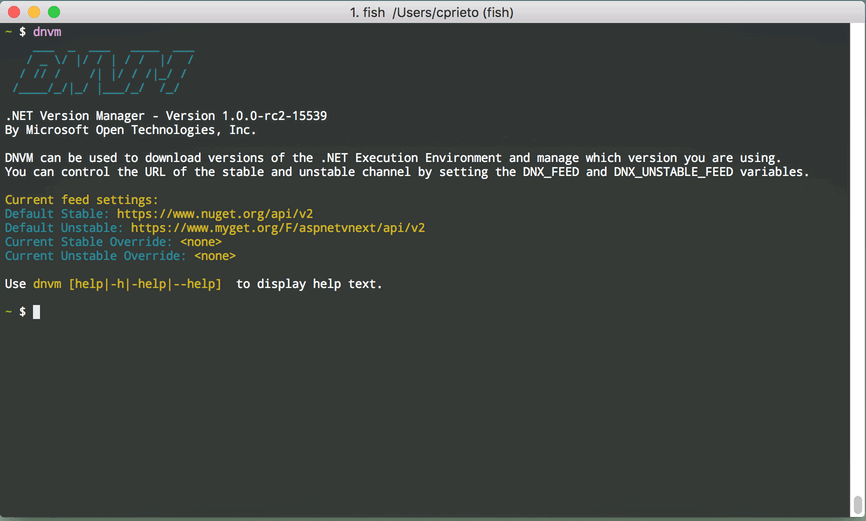

# DotNet Version Manager, Fish edition

[Fish shell](http://fishshell.com/) is an awesome shell for the 90's. Sadly it is very different than other POSIX shells like ZSH or Bash, this makes many shell scripts incompatible.

One of those shell scripts is [DNVM](https://github.com/aspnet/dnvm) or DotNet Version Manager, so, no worries my friend, this is your solution, and it will allow you to use DNVM from your Fish console, yay!



## Requirements

1. You should be running fish (duh!)
2. You should have DNVM installed, follow instructions at (https://docs.asp.net/en/latest/getting-started/index.html)

## Installation

Download and install DNVM for fish, an easy way is:
```
curl -o ~/.config/fish/functions/dnvm.fish https://raw.githubusercontent.com/cprieto/fish_dnvm/master/dnvm.fish
```

That's all, now you can use dnvm
